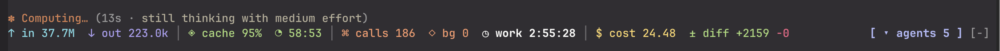
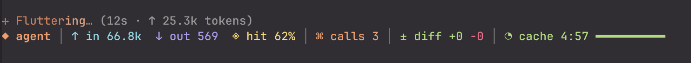
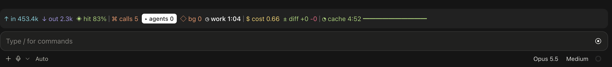

# claude-gadgets

Mods (hot-reloadable plugins) for Claude Code. Each mod is a self-contained plugin under `mods/<name>/`.

## Mods

| Mod | What it does |
| --- | --- |
| `flight-deck` | Band above the prompt: input/output/cache-hit tokens, tool calls, started subagents and background tasks, model working time, session cost, lines changed by file tools and a styled prompt-cache countdown. The totals include each subagent. When the transcript of a subagent is on the screen, the band shows the numbers of that subagent and of the agents below it. Data survives resume. |

## Toolchain

Bun, TypeScript 7 and Biome, every dependency pinned to an exact version (`bunfig.toml` sets `exact = true`).

```sh
bun install --frozen-lockfile
bun run check      # biome + tsc + claude plugin validate + claude plugin test
```

`tsc` needs the engine's typings in `mods/<name>/.claude-plugin/types/claude-code/index.d.ts`. Claude Code writes them when it loads a mod; to type-check before the first load, copy the file the `plugin-authoring` skill names (it is gitignored).

## Loading a mod

- CLI: `claude --plugin-dir mods/flight-deck` (hot reloads on save).
- Claude Desktop (Code tab): set `CLAUDE_CODE_PLUGIN_DIRS` to the absolute mod path in the `env` block of `~/.claude/settings.json`.

`flight-deck` option `cacheTtl` is `5m` (default) or `1h`. Set `1h` when your session uses the 1-hour prompt cache.

## Agents pane

`flight-deck` has a pane that shows the subagents of the session.

- Press `◆ agents N` on the band, or run `/agent-log`, to open the pane. Do the same to close it.
- The pane lists the subagents as a tree. A child agent is below its parent.
- Press an agent to see its transcript. Press a tool call to see its input and its result.
- The pane shows an agent after it completes, after a new message starts it again, and after `--resume`.

Limits:

- An agent that started before the mod loaded is not in the list.
- The engine does not let a mod read the agents of a workflow run. The same is true for a teammate in its own terminal pane. The pane shows the refusal text of the engine.

## Adding a mod

Run the `/new-mod <name>` skill, or copy `mods/flight-deck` and trim it. Rules the engine enforces: the `types` contract is self-contained (no imports), helpers that take `$` are module-level function declarations, and plugin files link with static `import` only.

## Layout

```
mods/<name>/{.claude-plugin/plugin.json, hooks/, src/, types/index.d.ts, tsconfig.json}
docs/specs/   design specs
docs/plans/   implementation plans
```

## Preview

### Claude Code CLI

- Main view


- Session view


### Claude Desktop


## License

[MIT](LICENSE)
