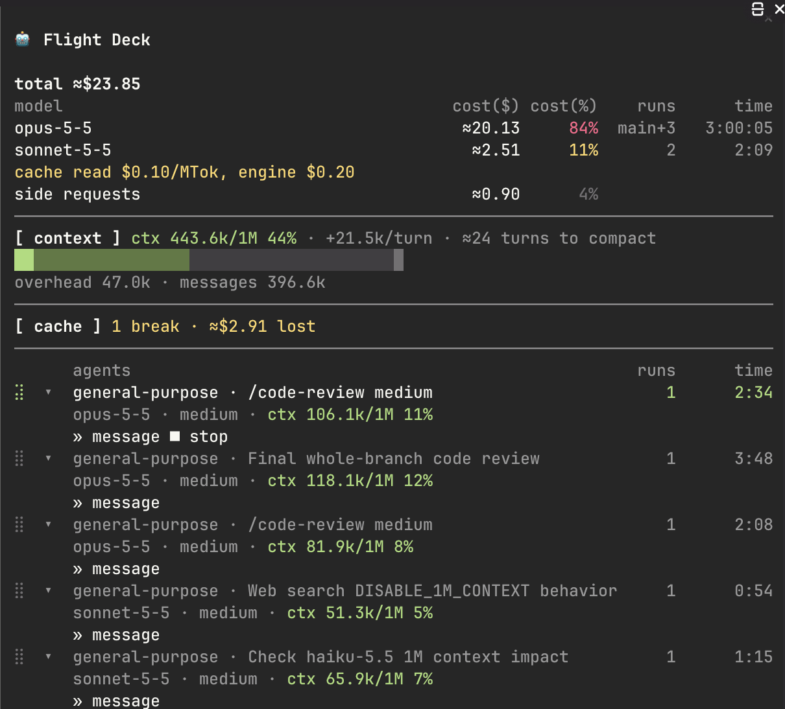
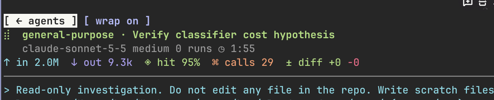
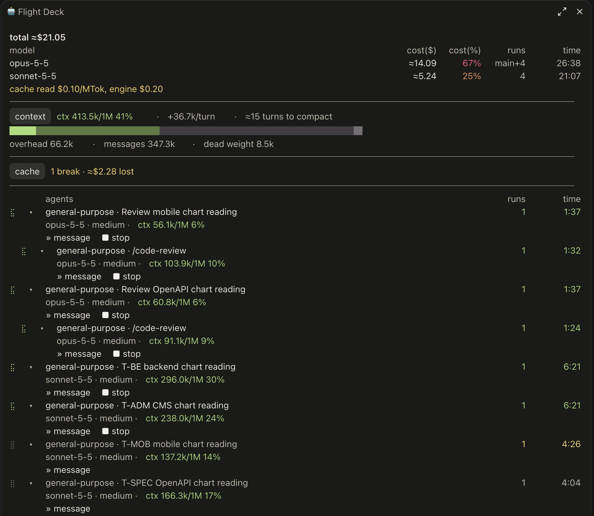
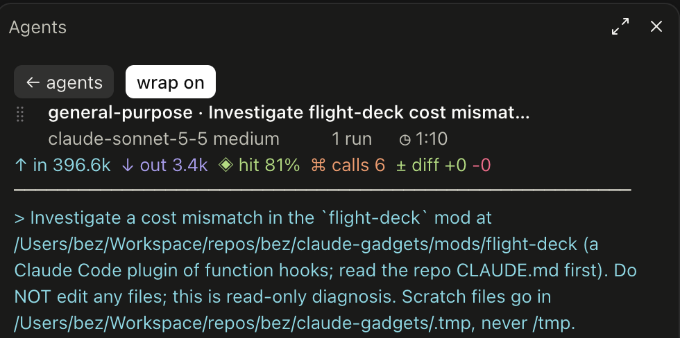

# claude-gadgets

[English](../../README.md) · Tiếng Việt

> Bản dịch của [`README.md`](../../README.md) tại commit `4405a0f`. Khi hai bản khác nhau, bản tiếng Anh là bản chuẩn.

Các mod (plugin nạp lại nóng được) cho Claude Code. Mỗi mod là một plugin độc lập trong `mods/<name>/`.

## Các mod

| Mod | Chức năng |
| --- | --- |
| `flight-deck` | Một dải phía trên ô nhập. Dải hiển thị token vào, token ra, tỉ lệ cache hit, số lần gọi tool, số subagent và số tác vụ nền đã khởi chạy, thời gian model làm việc, chi phí của session, số dòng mà các tool sửa file đã thay đổi và đồng hồ đếm ngược của prompt cache. Các tổng số gồm cả mọi subagent. Khi transcript của một subagent đang ở trên màn hình, dải hiển thị số liệu của subagent đó và của các agent bên dưới nó. Dữ liệu được giữ lại khi resume. |

## Bộ công cụ

Bun, TypeScript 7 và Biome. Mọi dependency được ghim vào một phiên bản chính xác (`bunfig.toml` đặt `exact = true`).

```sh
bun install --frozen-lockfile
bun run check      # biome + tsc + claude plugin validate + claude plugin test
```

`tsc` cần typings của engine tại `mods/<name>/.claude-plugin/types/claude-code/index.d.ts`. Claude Code ghi file này khi nó nạp một mod. Để kiểm tra kiểu trước lần nạp đầu tiên, hãy sao chép file mà skill `plugin-authoring` chỉ ra (file này nằm trong gitignore).

## Nạp một mod

- CLI: `claude --plugin-dir mods/flight-deck` (nạp lại nóng mỗi khi lưu file).
- Claude Desktop (tab Code): đặt `CLAUDE_CODE_PLUGIN_DIRS` bằng đường dẫn tuyệt đối của mod trong khối `env` của `~/.claude/settings.json`.

Tuỳ chọn `cacheTtl` của `flight-deck` nhận `5m` (mặc định) hoặc `1h`. Hãy đặt `1h` khi session của bạn dùng prompt cache 1 giờ.

## Pane agents

`flight-deck` có một pane hiển thị các subagent của session.

- Bấm `◆ agents N` trên dải, hoặc chạy `/agent-log`, để mở pane. Làm lại thao tác đó để đóng pane.
- Pane liệt kê các subagent theo dạng cây. Agent con nằm dưới agent cha.
- Bấm vào một agent để xem transcript của nó. Bấm vào một lần gọi tool để xem input và kết quả của nó.
- Mỗi hàng agent có một hàng chi tiết và một nút mở rộng. Hàng chi tiết mở sẵn, và nút này ẩn hoặc hiện nó. Hàng chi tiết hiển thị model, effort và độ dài context của agent (`ctx 182.4k/1M 18%`). Màu là xanh lá dưới 50%, vàng từ 50% và đỏ từ 80%.
- Màn hình transcript hiển thị cùng độ dài context đó bên dưới tiêu đề.
- Một hàng agent đang mở có hai nút điều khiển. `» message` mở một ô nhập: gõ tin nhắn rồi bấm Enter để gửi cho agent. Một agent đã hoàn thành sẽ chạy lại. `■ stop` dừng một agent đang chạy ở lần bấm thứ hai.
- Màn hình transcript có hai nút đó trên thanh công cụ, và trên thanh luôn nằm trong tầm nhìn khi cuộn. Ô nhập tin nhắn của nó nằm sau mục cuối cùng: `» message` đưa focus tới đó.
- Pane vẫn hiển thị một agent sau khi agent đó hoàn thành, sau khi một tin nhắn mới khởi chạy lại nó, và sau `--resume`.

Giới hạn:

- Một agent đã khởi chạy trước khi mod được nạp thì không có trong danh sách.
- Ở auto mode, engine không gửi tin nhắn từ pane. Hãy thêm `"SendMessage"` vào `permissions.allow` trong settings. Rule này cũng cho model gửi tin nhắn mà không qua kiểm tra.
- `» message` chỉ đưa con trỏ vào ô nhập khi prompt của session đang trống. Khi prompt có chữ, hãy bấm vào ô nhập.
- Mỗi câu trả lời của một agent, và mỗi lần stop, làm vòng lặp chính chạy một turn: engine gửi cho nó một thông báo.
- Engine không cho một mod đọc các agent của một lần chạy workflow. Một teammate chạy trong pane terminal riêng cũng vậy. Pane hiển thị thông báo từ chối của engine.

## Màn hình context

Pane hiển thị những gì đang chiếm context window của vòng lặp chính.

- Bên dưới dashboard, một khối hiển thị độ dài context (`ctx 84.2k/200k 42%`), một thanh và ba tổng số. Thanh hiển thị overhead bằng màu của độ dài context, messages bằng sắc đậm hơn của màu đó, rồi phần còn trống và phần mà auto-compaction giữ lại bằng hai màu xám.
- Overhead là nội dung mà mỗi request mang theo trước cuộc hội thoại: system prompt, các tool, các file memory và các skill.
- Bấm `context` để xem overhead theo từng category. Bấm vào một category có dấu `▸` để xem các MCP server, các file memory hoặc các skill của nó.
- `carry($)` là ước lượng chi phí của overhead trong session này: số token của nó, nhân với số step của vòng lặp chính và với giá cache read.
- `dead weight` liệt kê các MCP server có tool đã nạp mà session chưa gọi.
- Màn hình mở ra với một lần đếm đầy đủ. Lần đếm này gửi một request token-count cho mỗi tool và mỗi file memory. Bấm `recount` để đếm lại.

Giới hạn:

- Các con số là của vòng lặp chính. Engine không cho breakdown context của một subagent.
- Một tool nạp theo yêu cầu thì không nằm trong window, nên không nằm trong overhead.

## Thêm một mod

Chạy skill `/new-mod <name>`, hoặc sao chép `mods/flight-deck` rồi lược bớt. Engine bắt buộc ba quy tắc:

- Hợp đồng `types` phải độc lập, không có import.
- Hàm trợ giúp nhận `$` phải là khai báo `function` ở cấp module.
- Các file của plugin chỉ liên kết với nhau bằng `import` tĩnh.

## Cấu trúc thư mục

```
mods/<name>/{.claude-plugin/plugin.json, hooks/, src/, types/index.d.ts, tsconfig.json}
docs/specs/   đặc tả thiết kế
docs/plans/   kế hoạch triển khai
docs/i18n/    các bản dịch của README
```

## Xem trước

### Claude Code CLI

- Màn hình chính


- Bảng agent


- Transcript của agent


### Claude Desktop

- Dải phía trên ô nhập


- Bảng agent


- Transcript của agent


## Giấy phép

[MIT](../../LICENSE)
